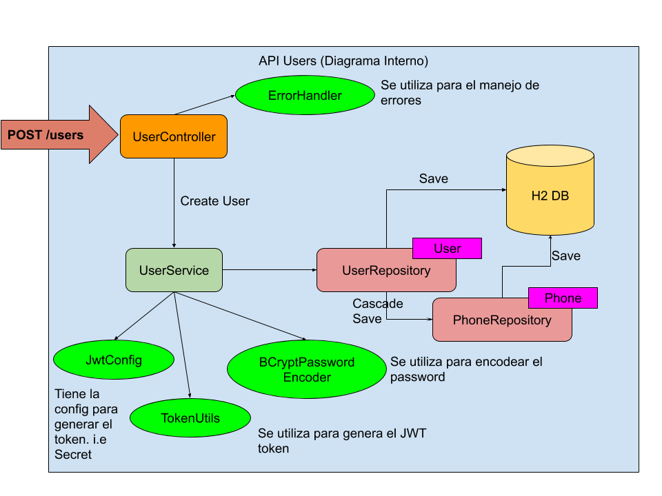

# Getting Started

### Reference Documentation
You need:
* Java SDK 8
* Gradle

#### Compile and run test
```./gradlew clean build```

#### Start up Local environment
```./gradlew bootRun```

#### URL CURLS


Create
```
curl -X POST \
  http://localhost:8080/users \
  -H 'Content-Type: application/json' \
  -d '{
      	"name": "Juan Rodriguez",
      	"email": "juan@rodriguez.org",
      	"password": "Ap32",
      	"phones": [
      		{
      			"number": "1234567",
      			"cityCode": "1",
      			"countryCode": "57"
      		}
      	]
      }'
```
#### Diagrama de la solución


### Notas Adicionales
* Sólo se realizaron test unitarios para UserService